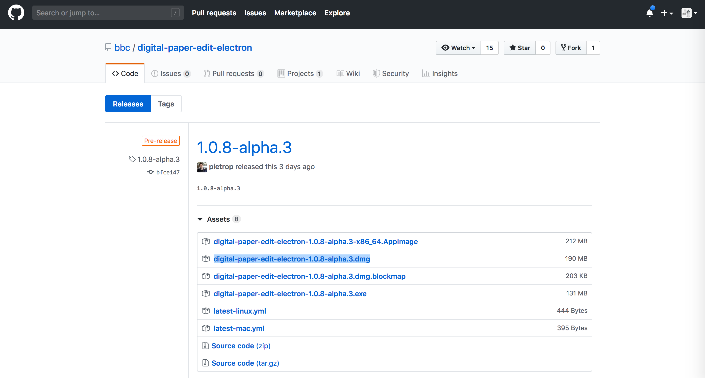

# User Instructions - Draft

Here are some instructions for using a packaged version of the app for desktop, (we still have to draft a user manual for this tool so if anything is not clear let us know so that we can feed it back into it)

You can download the pre release from [this link](https://github.com/bbc/digital-paper-edit-electron/releases).

## Installation

### Mac

1. Click `Assets` on the version you would like (the newest one is at the top)
2. Click the `digital-paper-edit-electron-<version>.dmg` to download the `dmg` file
3. Once downloaded, double click and open the `dmg` file
4. Drag the app into the applications folder

The app comes with two example projects, to make it easier to try it out and evaluate on first use.

## Options

## Speech-to-text (STT) Settings

1. Launch the app `digital-paper-edit-electron` in the applications folder
2. Click on the `Speech To Text Settings` in the menu at the top
3. Select `Edit Speech To Text Configuration`.
4. Once the STT configuration window is opened, select default STT provider and language and click save
5. Enter API credentials from STT provider's dashboard (see links below) and click save

Current STT Providers:

- [Speechmatics](https://www.speechmatics.com/)
- [AssemblyAI](https://www.assemblyai.com/).

### [Speechmatics](https://www.speechmatics.com/)

Free tier: 30 minutes
Supports: Multiple languages

### [AssemblyAI](https://www.assemblyai.com/)

Free tier: 1 month
Supports: English

## Creating a project

In the main window you can create a project (to group your transcripts and paper edits)

## Transcribing Audio / Video

Once a project is created, you can create a transcript and get some audio or video file transcribed.

Note: At a later stage I might do some optimization so that it could take 5 minutes regardless of how long the media is, by chunking and sending in parallel but not now the speed of the Transcription is dependent on the provider, generally a little less then real-time, assemblyAI might be slightly faster then Speechmatics but not sure.

## Editing Transcripts

If you click on the transcript when it's ready, It is possible to correct the transcript using the editor (but at the moment this function is not fully integrated with the rest of the system, so would recommend skipping it for now until it is)

## Creating a programme script (paper edit)

Once you have a transcript you can create a programme script (paper edit).
Int he programme script / paper edit view you can:

* access project's transcripts
* highlight and annotate
* create custom labels
* search and filter ( at the moment with a transcript but in the future across transcripts in a project)

## Editing the programme script

In the programme script view you have transcripts on the left and programme script on the right.
You can add selected text from the transcript to the programme script by clicking the + button.
It's possible to rearrange or delete text snippets in the programme script.
You can also generate a preview.

## Exporting the programme script

When you are done there is an export button in the programme script.

### Adobe Premiere
To export to Premiere, choose EDL (edit decision list).
Once it's exported you can import the EDL in Premiere as a sequence.
The clips will be offline. To continue editing, you will need to manually reconnect the files in Premiere.

<!-- Hope this is not too detailed, and that is easy to follow. Let me know how you get on and if you have any questions  -->
